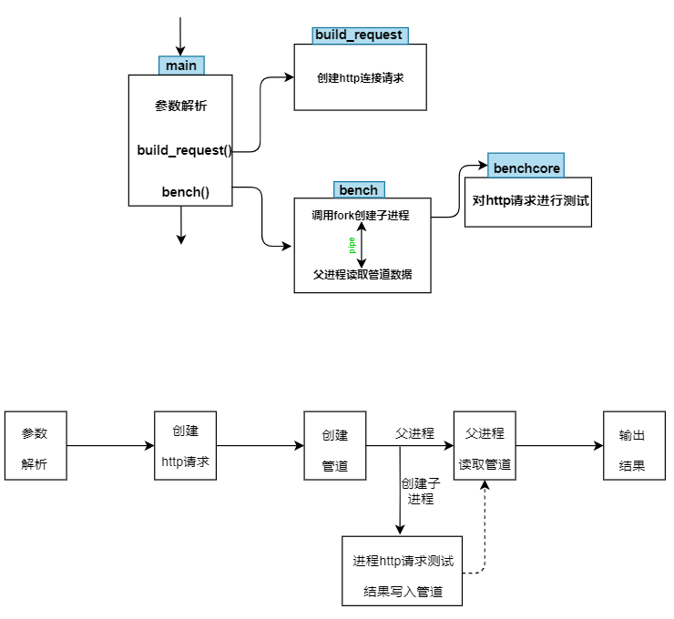

# WebBench

Webbench是一个在linux下使用的非常简单的网站压测工具。它使用fork()模拟多个客户端同时访问我们设定的URL，测试网站在压力下工作的性能，最多可以模拟3万个并发连接去测试网站的负载能力。

## 依赖
ctags

## 使用：

	sudo make && sudo make install PREFIX=your_path_to_webbench
  
## 命令行选项：

| 短参        | 长参数           | 作用   |
| ------------- |:-------------:| -----:|
|-f     |--force                |不需要等待服务器响应               | 
|-r     |--reload               |发送重新加载请求                   |
|-t     |--time <sec>           |运行多长时间，单位：秒"            |
|-p     |--proxy <server:port>  |使用代理服务器来发送请求	    |
|-c     |--clients <n>          |创建多少个客户端，默认1个"         |
|-9     |--http09               |使用 HTTP/0.9                      |
|-1     |--http10               |使用 HTTP/1.0 协议                 |
|-2     |--http11               |使用 HTTP/1.1 协议                 |
|       |--get                  |使用 GET请求方法                   |
|       |--head                 |使用 HEAD请求方法                    |
|       |--options              |使用 OPTIONS请求方法               |
|       |--trace                |使用 TRACE请求方法                 |
|-?/-h  |--help                 |打印帮助信息                       |
|-V     |--version              |显示版本号                         |

## WebBench 源码主要包括两个文件，一个是 socket.c 和 webbecnh.c 
+ socket.c 封装了一个socket模块
+ webbench.c 是主要文件， 完成整个网站过程
	+ 阅读顺序： main -> 对命令参数的解析 -> 调用 bulid_request函数构建HTTP的"get"请求头部 -> 调用bench测试函数 -> 主进程读取管道 -> 输出
